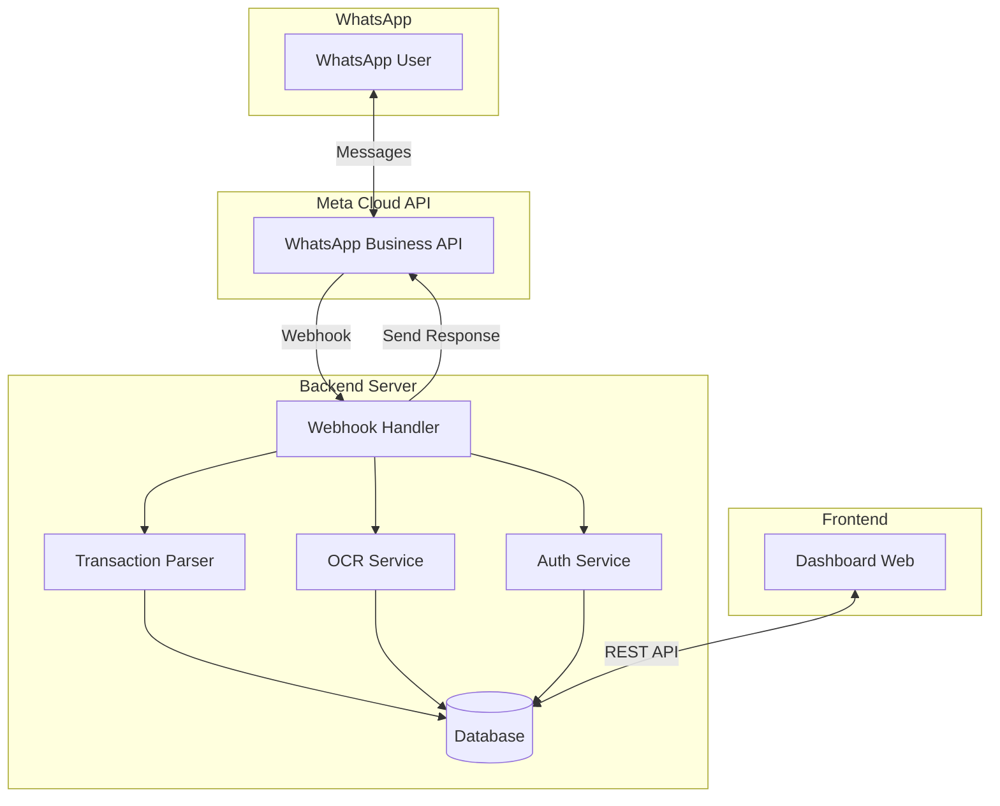
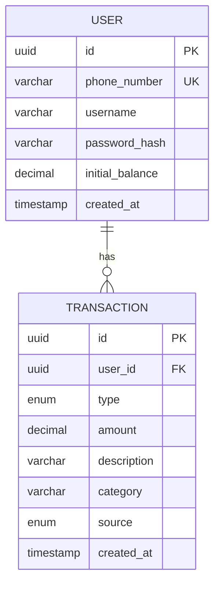

# Design Document: WhatsApp Integration untuk Catat Uang

## Overview

Fitur ini mengintegrasikan aplikasi Catat Uang dengan WhatsApp untuk memungkinkan pencatatan transaksi keuangan melalui pesan chat. Sistem terdiri dari tiga komponen utama:

1. **WhatsApp Bot** - Menerima dan memproses pesan dari pengguna
2. **Backend API** - Menangani webhook, parsing, dan penyimpanan data
3. **Dashboard Web** - Menampilkan data transaksi secara real-time

Arsitektur menggunakan WhatsApp Business API (gratis via Meta Cloud API) dengan webhook untuk menerima pesan masuk.

## Architecture



### Technology Stack

- **Backend**: Node.js dengan Express.js
- **Database**: SQLite (untuk MVP) atau PostgreSQL (production)
- **WhatsApp API**: Meta Cloud API (gratis hingga 1000 conversations/bulan)
- **OCR**: Google Cloud Vision API atau Tesseract.js
- **Frontend**: React (existing) dengan real-time updates via polling/WebSocket

## Components and Interfaces

### 1. Webhook Handler (`/api/webhook`)

```typescript
interface WebhookPayload {
  object: 'whatsapp_business_account';
  entry: WebhookEntry[];
}

interface WebhookEntry {
  id: string;
  changes: WebhookChange[];
}

interface WebhookChange {
  value: {
    messaging_product: 'whatsapp';
    metadata: { phone_number_id: string };
    messages?: IncomingMessage[];
  };
}

interface IncomingMessage {
  from: string;  // Phone number
  id: string;
  timestamp: string;
  type: 'text' | 'image';
  text?: { body: string };
  image?: { id: string; mime_type: string };
}
```

### 2. Transaction Parser

```typescript
interface TransactionParser {
  parse(message: string): ParseResult;
  formatAmount(amount: number): string;
  parseAmount(amountStr: string): number;
}

interface ParseResult {
  success: boolean;
  data?: ParsedTransaction;
  error?: string;
  command?: CommandType;
}

type CommandType = 'income' | 'expense' | 'set_balance' | 'get_balance' | 'help' | 'unknown';

interface ParsedTransaction {
  type: 'income' | 'expense';
  amount: number;
  description: string;
}
```

### 3. Message Router

```typescript
interface MessageRouter {
  route(message: IncomingMessage, user: User): Promise<ResponseMessage>;
}

interface ResponseMessage {
  to: string;
  type: 'text';
  text: { body: string };
}
```

### 4. User Service

```typescript
interface UserService {
  findOrCreate(phoneNumber: string): Promise<User>;
  authenticate(phoneNumber: string): Promise<User>;
  updatePassword(userId: string, newPassword: string): Promise<void>;
  updateInitialBalance(userId: string, amount: number): Promise<void>;
}

interface User {
  id: string;
  phoneNumber: string;
  username: string;
  passwordHash: string;
  initialBalance: number;
  createdAt: Date;
}
```

### 5. Transaction Service

```typescript
interface TransactionService {
  create(userId: string, data: ParsedTransaction): Promise<Transaction>;
  getByUserId(userId: string): Promise<Transaction[]>;
  getStats(userId: string): Promise<SummaryStats>;
}
```

## Data Models

### User Table

| Field | Type | Description |
|-------|------|-------------|
| id | UUID | Primary key |
| phone_number | VARCHAR(20) | WhatsApp number (unique) |
| username | VARCHAR(20) | Same as phone_number |
| password_hash | VARCHAR(255) | Bcrypt hashed password |
| initial_balance | DECIMAL(15,2) | User's initial balance |
| created_at | TIMESTAMP | Account creation time |

### Transaction Table

| Field | Type | Description |
|-------|------|-------------|
| id | UUID | Primary key |
| user_id | UUID | Foreign key to User |
| type | ENUM | 'income' or 'expense' |
| amount | DECIMAL(15,2) | Transaction amount |
| description | VARCHAR(255) | Transaction description |
| category | VARCHAR(50) | Auto-categorized |
| source | ENUM | 'whatsapp' or 'dashboard' |
| created_at | TIMESTAMP | Transaction time |

### ERD



## Correctness Properties

*A property is a characteristic or behavior that should hold true across all valid executions of a system-essentially, a formal statement about what the system should do. Properties serve as the bridge between human-readable specifications and machine-verifiable correctness guarantees.*

### Property 1: Transaction Parsing Round-Trip

*For any* valid transaction (income or expense) with any amount and description, formatting the transaction to message string then parsing it back SHALL produce an equivalent transaction object.

**Validates: Requirements 2.1, 2.2**

### Property 2: Amount Shorthand Conversion

*For any* numeric amount, converting to shorthand notation (rb, jt) then parsing back SHALL produce the same numeric value.

**Validates: Requirements 2.3**

### Property 3: Invalid Message Handling

*For any* message string that does not match valid command patterns, the parser SHALL return an error result with command type 'unknown'.

**Validates: Requirements 1.4, 2.5, 4.3**

### Property 4: User Registration Idempotence

*For any* phone number, calling findOrCreate multiple times SHALL always return the same user with the same credentials.

**Validates: Requirements 1.1, 1.3**

### Property 5: Initial Balance Update Consistency

*For any* user and any valid amount, setting initial balance then querying it SHALL return the same amount.

**Validates: Requirements 3.1, 3.2**

### Property 6: Transaction Persistence

*For any* set of transactions added for a user, querying all transactions for that user SHALL return all added transactions.

**Validates: Requirements 5.2**

### Property 7: User Data Isolation

*For any* two different users, querying transactions for user A SHALL never return transactions belonging to user B.

**Validates: Requirements 8.3**

### Property 8: Password Security

*For any* user, the stored password_hash SHALL not equal the plaintext password.

**Validates: Requirements 8.1**

### Property 9: Webhook Signature Validation

*For any* webhook request, requests with invalid signatures SHALL be rejected before processing.

**Validates: Requirements 7.1**

### Property 10: Message Routing Correctness

*For any* incoming message, the router SHALL route text messages to Transaction Parser and image messages to OCR Service.

**Validates: Requirements 7.2**

## Error Handling

### Error Categories

1. **Parsing Errors** - Invalid message format
   - Response: Help message dengan contoh format yang benar
   
2. **Authentication Errors** - User tidak ditemukan
   - Response: Auto-create user baru
   
3. **Validation Errors** - Amount invalid, description kosong
   - Response: Pesan error spesifik dengan saran perbaikan
   
4. **System Errors** - Database down, API timeout
   - Response: Generic error message, log untuk debugging

### Error Response Format

```typescript
interface ErrorResponse {
  success: false;
  error: {
    code: string;
    message: string;
    suggestion?: string;
  };
}
```

### Error Messages (Indonesian)

| Error Code | Message |
|------------|---------|
| INVALID_FORMAT | "Format tidak valid. Ketik 'bantuan' untuk panduan." |
| INVALID_AMOUNT | "Jumlah tidak valid. Contoh: + 20000 makan siang" |
| EMPTY_DESCRIPTION | "Deskripsi tidak boleh kosong." |
| OCR_FAILED | "Gagal membaca struk. Silakan input manual." |
| SYSTEM_ERROR | "Terjadi kesalahan. Silakan coba lagi." |

## Testing Strategy

### Property-Based Testing Library

Menggunakan **fast-check** untuk property-based testing di TypeScript/JavaScript.

### Unit Tests

Unit tests akan mencakup:
- Transaction Parser: parsing berbagai format input
- Amount Parser: konversi shorthand (rb, jt, k)
- User Service: CRUD operations
- Webhook Handler: signature validation

### Property-Based Tests

Setiap correctness property akan diimplementasi sebagai property-based test dengan minimum 100 iterasi:

```typescript
// Example: Property 1 - Transaction Parsing Round-Trip
// **Feature: whatsapp-integration, Property 1: Transaction Parsing Round-Trip**
fc.assert(
  fc.property(
    fc.record({
      type: fc.constantFrom('income', 'expense'),
      amount: fc.integer({ min: 1, max: 999999999 }),
      description: fc.string({ minLength: 1, maxLength: 100 })
    }),
    (transaction) => {
      const formatted = formatTransaction(transaction);
      const parsed = parseTransaction(formatted);
      return parsed.success && 
             parsed.data.type === transaction.type &&
             parsed.data.amount === transaction.amount &&
             parsed.data.description === transaction.description;
    }
  ),
  { numRuns: 100 }
);
```

### Integration Tests

- Webhook endpoint dengan mock WhatsApp payload
- Full flow: message → parse → save → query
- Dashboard API dengan authenticated requests

### Test Coverage Requirements

- Transaction Parser: 100% coverage
- Amount Parser: 100% coverage
- User Service: 90% coverage
- Webhook Handler: 90% coverage
